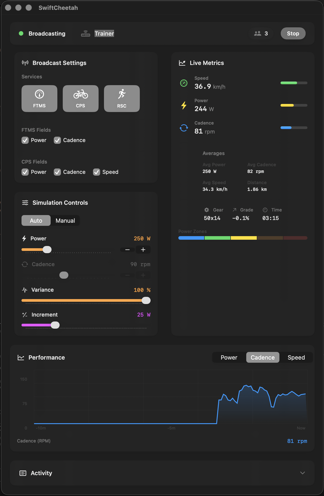

#  SwiftCheetah (macOS)

## Overview

SwiftCheetah is a macOS app (Swift/SwiftUI) that acts as a Bluetooth LE peripheral for fitness software. It broadcasts FTMS, CPS and RSC services and generates realistic indoor‑bike metrics using research‑backed physics and cadence models. The codebase is split into a pure core (engine) and the BLE/app layers.

## Status

### Completed Features

- BLE peripheral for FTMS (0x1826), CPS (0x1818), RSC (0x1814)
- FTMS Control Point with 20+ commands (Request Control, Reset, Set Target Power, Start/Stop, Set Indoor Bike Simulation)
- FTMS Indoor Bike Data notifications (speed encoded as 0, cadence, power)
- Research-based physics engine (power→speed calculations, cadence modeling with grade effects and gear constraints)
- Comprehensive validation system with safety clamping
- Clean architecture with separated concerns (god class refactored into focused components)
- 99 unit tests with research validation; GitHub Actions CI with build + test + lint

### Architecture

- **CyclingSimulationEngine**: Consolidated physics, cadence, and power simulation
- **FTMSControlPointHandler**: Strategy pattern for control command processing
- **BLENotificationScheduler**: Timer management with delegate pattern
- **SimulationStateManager**: Centralized state and configuration management
- **PeripheralManager**: Thin facade coordinator maintaining backward compatibility

### Newly Added Components

- **ValueValidator**: Input validation and physiological safety limits
- **Configuration**: Centralized constants and parameters with research documentation
- **RandomUtility**: Unified Box-Muller normal distribution generation

### TODO

- Add more end-to-end integration tests for CPS and RSC payloads
- Settings panel for engine parameters (mass, Crr, CdA, FTP), export/import configuration
- Error handling standardization
- Dead code elimination
- Packaging and release instructions

## System Requirements

- macOS 26 (Tahoe) runtime
- Xcode 26+ and Swift 6+ for building

## Repository Layout

- `Package.swift` — Swift package manifest (core + BLE)
- `Packages/SwiftCheetahCore/` — engine modules (physics, cadence, validation, configuration, utilities)
- `Packages/SwiftCheetahBLE/` — BLE layer (peripheral manager, control handlers, schedulers, encoders)
- `SwiftCheetah/` — macOS app GUI (App/, Views/, Resources/)
- `SwiftCheetahApp.xcodeproj` — Xcode project for macOS app (at repository root)
- `Tests/` — comprehensive unit tests with research validation, optional integration test harness

## Build and Run

- Xcode (recommended)
  1. Open `SwiftCheetahApp.xcodeproj`
  2. Select the `SwiftCheetahApp` scheme
  3. Set Signing (Automatic); build and run on "My Mac"

- SwiftPM (engine only)
  - `swift build`
  - `swift test` (engine + BLE encoding tests)

## CI

- GitHub Actions workflow builds the app target, runs unit tests and SwiftLint on push/PR.
- BLE integration tests are opt‑in; they require a central to run on the same machine and are skipped in CI by default.

## Design Notes

**Clean Architecture**: Separated concerns with focused components replacing the original god class:

- **CyclingSimulationEngine**: Research-validated physics with logistic power→cadence modeling, grade effects, gear constraints, fatigue accumulation/recovery, and Ornstein-Uhlenbeck variance
- **ValueValidator**: Comprehensive input validation with physiological safety limits and automatic clamping
- **Configuration System**: Centralized constants with research documentation replacing 400+ magic numbers

**Physics Engine**: Deterministic simulation using gravity/rolling/aero resistance with drivetrain efficiency, descent terminal velocity, and Newton-Raphson solver. All parameters validated against research ranges.

**BLE Protocol**: Full FTMS compliance with 20+ control commands, proper response/status handling, and dynamic notification scheduling.

## Known Limitations

- GUI layout and spacing need refinement

## Integration Test Harness (Optional)

- To run the central‑side integration test locally:
  - In Xcode: Edit Scheme → Test → Environment Variables → set `BLE_INTEGRATION=1`
  - Or via CLI: `BLE_INTEGRATION=1 xcodebuild -project SwiftCheetahApp.xcodeproj -scheme SwiftCheetahApp -destination 'platform=macOS' test`
  - The test scans, connects, subscribes to FTMS Indoor Bike Data, and asserts a notification payload.
